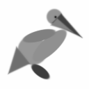
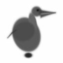
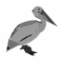

# Differentiable Pelican

**What if you could teach a computer to draw a pelican by telling it
"you're wrong" 10,000 times, and letting calculus do the rest?**



We approximate a target pelican image using circles, ellipses, and
triangles whose parameters are optimized via gradient descent
through a differentiable renderer. No neural network. No pixel
buffer. Just shapes, a loss function, and backpropagation.

## Why This Is Interesting

Most rendering pipelines are black boxes to an optimizer: you put
parameters in, you get pixels out, but you can't ask "how should I
nudge this ellipse to make the output look more like the target?"

Differentiable rendering changes that. By implementing the renderer
in a framework that tracks gradients (here, PyTorch), every pixel
in the output carries information about how it depends on each
shape's position, size, rotation, and intensity. We can compute
the gradient of a loss function (measuring how far the rendered
image is from the target) with respect to every shape parameter at
once, then follow those gradients to improve the image iteratively.

This is the same principle behind training neural networks --
define a loss, backpropagate, update parameters -- but applied to
an interpretable, symbolic representation rather than millions of
opaque weights. The shapes remain editable SVG primitives
throughout.

A few techniques here appear throughout differentiable programming:

- **Continuous relaxation of discrete structure.** An SVG circle is
  either there or it isn't, but we use
  [soft signed distance fields](https://iquilezles.org/articles/distfunctions2d/)
  with a sigmoid to make coverage a smooth function of shape
  parameters. Replacing hard decisions with soft approximations is
  a workhorse technique in differentiable programming, from
  [attention mechanisms](https://arxiv.org/abs/1706.03762) to
  [differentiable sorting](https://arxiv.org/abs/2002.08871).

- **Compositing as a differentiable program.** Shapes are layered
  with [Porter-Duff](https://dl.acm.org/doi/10.1145/800031.808606)
  alpha compositing, each shape's soft coverage acting as an alpha
  mask. The full pipeline -- raw parameters through SDF evaluation,
  sigmoid, and layer composition -- is one differentiable
  computation graph, so gradients flow from pixel-level loss back
  to every shape parameter in a single backward pass.

- **Composite loss design.** The loss combines pixel MSE,
  [structural similarity (SSIM)](https://doi.org/10.1109/TIP.2003.819861),
  Sobel edge matching, and geometric priors (overlap, boundary, and
  degeneracy penalties). Balancing pixel fidelity against structural
  and regularization objectives is a design challenge common to
  differentiable systems from image reconstruction to physics
  simulation.

- **Greedy search over discrete topology.** Gradient descent
  optimizes continuous parameters but can't decide _whether_ to add
  a shape. We use greedy forward selection: propose a candidate, let
  gradient descent find its optimal placement, keep it only if loss
  improves. This interplay between discrete search (what to add) and
  continuous optimization (where to put it) parallels patterns in
  neural architecture search, program synthesis, and
  mixture-of-experts routing.

## Results

Starting from 9 hand-coded shapes and a
[vintage pelican engraving](images/pelican-drawing-1.jpg) as the
target, the pipeline first optimizes via gradient descent, then
greedily adds shapes one at a time. Each candidate is placed by
gradient descent alone -- no heuristics, no LLM, no human in the
loop.

### Target and baseline optimization (9 shapes, 500 steps)

<p>

&nbsp;&nbsp;

</p>



### Greedy refinement (up to 35 shapes)

Each round: freeze existing shapes, optimize only the newcomer for
100 steps (settle phase), then unfreeze and re-optimize all shapes
together for 200 steps (joint phase). Keep only if loss drops.
All 26 candidates accepted, 0 rejected.

| Stage | Loss | Shapes | vs Baseline |
|-------|------|--------|-------------|
| Optimize (500 steps) | 0.0351 | 9 | -- |
| Greedy (20 shapes) | 0.0259 | 20 | -26% |
| Greedy (35 shapes) | 0.0238 | 35 | -32% |

<p>

&nbsp;&nbsp;

</p>

Per-round metrics and observations are in the
[research log](docs/research-log.md). The full image progression
is in [detailed results](docs/results/README.md).

## Quick Start

```bash
uv sync

# Render the initial hard-coded pelican (no optimization)
pelican test-render --resolution 128

# Optimize against the target image
pelican optimize --target images/pelican-drawing-1.jpg --steps 500

# Greedy refinement (no API key needed)
pelican greedy-refine --max-shapes 35

# LLM refinement loop (requires ANTHROPIC_API_KEY)
pelican refine --target images/pelican-drawing-1.jpg --rounds 5
```

## How It Works

```
Target Image  -->  Differentiable Renderer  -->  Loss Function
     ^                    |                          |
     |              Soft SDF + alpha-over      MSE + SSIM + Edge
     |                    |                          |
     |              Shape Parameters  <---  Gradient Descent (Adam)
     |                    |
     |              Greedy Refinement: add one shape, optimize, keep if better
     |                    |
     |              (Optional) LLM Judge + Architect for structural edits
     |                    |
     └────────────  Refinement Loop
```

- **Render** -- evaluate soft SDFs on a pixel grid, composite
  back-to-front via Porter-Duff alpha-over (all PyTorch tensor ops).
- **Optimize** -- Adam minimizes MSE + SSIM + edge + priors against
  the target. Tau (softness) anneals from blurry (strong gradients)
  to crisp (sharp edges).
- **Greedily add shapes** -- propose one candidate at a time, let
  gradient descent place it, keep only if loss improves.
- **LLM refinement (optional)** -- a multimodal judge evaluates the
  result, an architect proposes structural edits, the system rolls
  back on quality degradation.

## CLI Commands

| Command | Description |
|---------|-------------|
| `pelican test-render` | Render initial geometry without optimization |
| `pelican optimize` | Optimize shapes to match target image |
| `pelican greedy-refine` | Greedy forward-selection refinement loop |
| `pelican judge` | Evaluate optimized SVG with LLM |
| `pelican refine` | Full refinement loop with LLM feedback |
| `pelican validate-image` | Validate a rendered image with LLM |

## Docs

- [Pelican Plan](docs/design/pelican-plan.md) -- full design document
  (rendering approach, loss functions, LLM integration, rationale)
- [Research log](docs/research-log.md) -- experiment history with
  per-round metrics
- [Installation](docs/installation.md) -- uv and Python setup
- [Development](docs/development.md) -- dev workflows
- [Publishing](docs/publishing.md) -- PyPI publishing

---

*Built from [simple-modern-uv](https://github.com/jlevy/simple-modern-uv).*
