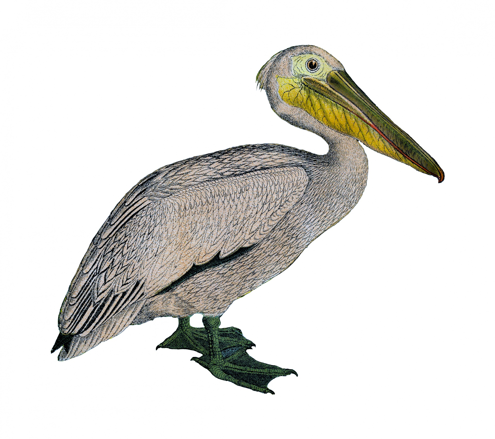
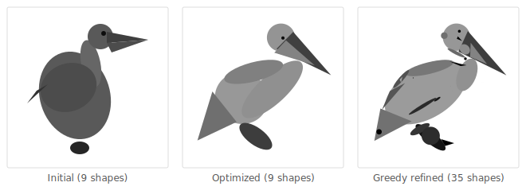

# Differentiable Pelican

Gradient-based optimization of SVG primitives through a differentiable
renderer, with optional LLM-guided structural refinement.

The renderer is implemented entirely in
[PyTorch](https://pytorch.org/) as soft
[signed distance fields](https://iquilezles.org/articles/distfunctions2d/)
(circles, ellipses, triangles) composited via
[Porter-Duff](https://dl.acm.org/doi/10.1145/800031.808606) alpha-over.
Because every operation is a differentiable tensor op, we can
backpropagate a pixel-level loss through the full rendering pipeline
to the shape parameters -- position, size, rotation, intensity -- and
optimize them with standard gradient descent.

This is an example of
[differentiable programming](https://en.wikipedia.org/wiki/Differentiable_programming):
treating an entire program (here, an SVG renderer) as a differentiable
function and optimizing its inputs via gradients. The same idea
underlies neural network training, but here the "model" is a handful
of interpretable geometric primitives rather than millions of opaque
weights. The output is valid SVG at every step.

## Key ideas

**Continuous relaxation.** SVG shapes are inherently discrete, but
[soft SDFs](https://iquilezles.org/articles/distfunctions2d/) with a
sigmoid (`coverage = sigmoid(-sdf / tau)`) make coverage a smooth
function of shape parameters. This is the same trick behind soft
attention ([Vaswani et al., 2017](https://arxiv.org/abs/1706.03762))
and differentiable sorting
([Blondel et al., 2020](https://arxiv.org/abs/2002.08871)) --
replacing hard decisions with smooth approximations so gradients can
flow.

**Composite loss.** The loss combines pixel MSE,
[SSIM](https://doi.org/10.1109/TIP.2003.819861) (structural
similarity), Sobel edge matching, and geometric priors (overlap,
boundary, and degeneracy penalties).

**Greedy topology search.** Gradient descent optimizes continuous
parameters but can't decide whether to add a shape. A greedy
forward-selection loop proposes candidates one at a time, lets
gradient descent find optimal placement, and keeps each shape only if
it reduces loss. This discrete/continuous interplay parallels
[neural architecture search](https://arxiv.org/abs/1802.03268) and
mixture-of-experts routing.

**LLM structural refinement (optional).** A multimodal LLM
([Claude](https://www.anthropic.com/claude), via the
[Anthropic API](https://docs.anthropic.com/en/api/getting-started))
acts as judge and architect: it evaluates the current render, proposes
structural edits (add/remove/modify shapes), and the system rolls back
on quality degradation.

## Results

Target: a [vintage pelican engraving](images/pelican-drawing-1.jpg)
(public domain).



Starting from 9 hand-coded shapes, the pipeline optimizes via gradient
descent (500 steps of Adam), then greedily adds shapes one at a time
-- freeze existing, settle the newcomer (100 steps), re-optimize all
jointly (200 steps), keep only if loss drops. 15 of 21 greedy candidates
were accepted. The full progression, initial through final:



| Stage | Loss | Shapes | vs Baseline |
|-------|------|--------|-------------|
| Initial geometry | -- | 9 | -- |
| Optimized (500 steps) | 0.0341 | 9 | -- |
| Greedy refined (24 shapes) | 0.0264 | 24 | -23% |

Per-round metrics in the [research log](docs/research-log.md).
Full image progression in [detailed results](docs/results/README.md).

## Pipeline

```
Target Image  -->  Differentiable Renderer  -->  Loss Function
     ^                    |                          |
     |              Soft SDF + alpha-over      MSE + SSIM + Edge
     |                    |                          |
     |              Shape Parameters  <---  Gradient Descent (Adam)
     |                    |
     |              Greedy Refinement: add one shape, optimize, keep if better
     |                    |
     |              (Optional) LLM Judge + Architect for structural edits
     |                    |
     └────────────  Refinement Loop
```

## Quick start

```bash
uv sync

pelican test-render --resolution 128
pelican optimize --target images/pelican-drawing-1.jpg --steps 500
pelican greedy-refine --max-shapes 35
pelican refine --target images/pelican-drawing-1.jpg --rounds 5  # requires ANTHROPIC_API_KEY
```

## CLI commands

| Command | Description |
|---------|-------------|
| `pelican test-render` | Render initial geometry (no optimization) |
| `pelican optimize` | Gradient-optimize shapes to match target image |
| `pelican greedy-refine` | Greedy forward-selection refinement loop |
| `pelican judge` | Evaluate current SVG with LLM |
| `pelican refine` | Multi-round LLM refinement loop |
| `pelican validate-image` | LLM-based image validation |

## Stack

| Library | Role |
|---------|------|
| [PyTorch](https://pytorch.org/) `>=2.1` | Differentiable rendering, autograd, optimization |
| [Pillow](https://pillow.readthedocs.io/) `>=10.0` | Image I/O |
| [imageio](https://imageio.readthedocs.io/) `>=2.31` | GIF generation |
| [Rich](https://rich.readthedocs.io/) `>=13.0` | Terminal UI, progress bars |
| [Anthropic SDK](https://docs.anthropic.com/en/api/client-sdks) `>=0.18` | LLM integration (optional) |
| [Pydantic](https://docs.pydantic.dev/) `>=2.0` | Structured LLM response validation |

## Docs

- [Pelican Plan](docs/design/pelican-plan.md) -- full design document
  (rendering approach, loss functions, LLM architecture, rationale)
- [Research log](docs/research-log.md) -- experiment history
- [Installation](docs/installation.md) -- uv and Python setup
- [Development](docs/development.md) -- dev workflows
- [Publishing](docs/publishing.md) -- PyPI publishing

---

*Built from [simple-modern-uv](https://github.com/jlevy/simple-modern-uv).*
