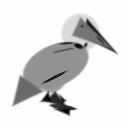

# End-to-End Pipeline Results

Full pipeline run on 2026-02-13 at 128x128 resolution on CPU.

## Pipeline Stages

### 0. Target Image

The vintage engraving pelican from Public Domain Pictures:

### 1. Test Render (Initial Geometry)

9-shape hard-coded pelican with named anatomical parts (body, neck, head,
beak_upper, beak_lower, wing, tail, eye, feet), each with grayscale intensity:

### 2. Optimization (500 steps, Adam, lr=0.02)

Gradient descent minimizing MSE + SSIM + edge + geometric priors.
Final loss: **0.0351** after 500 steps.

Optimization animation:

### 3. Refinement Loop (LLM Judge + Architect)

Multi-round refinement with Claude Sonnet 4.5 judge and architect:

**Round 1** (post-optimization, before LLM edits):

**Final** (best from 5 rounds, restored via deep copy):

## Metrics Summary

| Stage | Loss | Shapes | Notes |
|-------|------|--------|-------|
| Test render | N/A | 9 | Initial hard-coded geometry |
| Optimize (500 steps) | 0.0351 | 9 | Best single-run result |
| Refine round 1 | 0.0382 | 9 | First optimization in refinement |
| Refine round 2 | 0.0342 | 14 | LLM added 5 shapes, loss improved |
| Refine round 3 | 0.0326 | 18 | Further additions, continued improvement |
| Refine round 4 | 0.0320 | 19 | Best loss achieved |
| Refine round 5 | 0.0337 | 19 | Slight regression |
| Refine final | 0.0320 | 19 | Best shapes restored via deep copy |

## Observations

1. **Optimization works well**: 500 steps of gradient descent produces a
   recognizable pelican silhouette from the initial geometry.

2. **Refinement loop improving**: The architect adds meaningful shapes
   (throat_pouch, wing_feathers, webbed_foot) and loss steadily decreases
   across rounds. Best-state deep copy ensures the final output always uses
   the highest-quality shapes regardless of topology changes.

3. **Key areas for improvement**:
   - Architect prompt needs more context about current shape layout
   - Edit validation should reject duplicate shape names
   - Consider warm-starting optimization with existing params after edits
